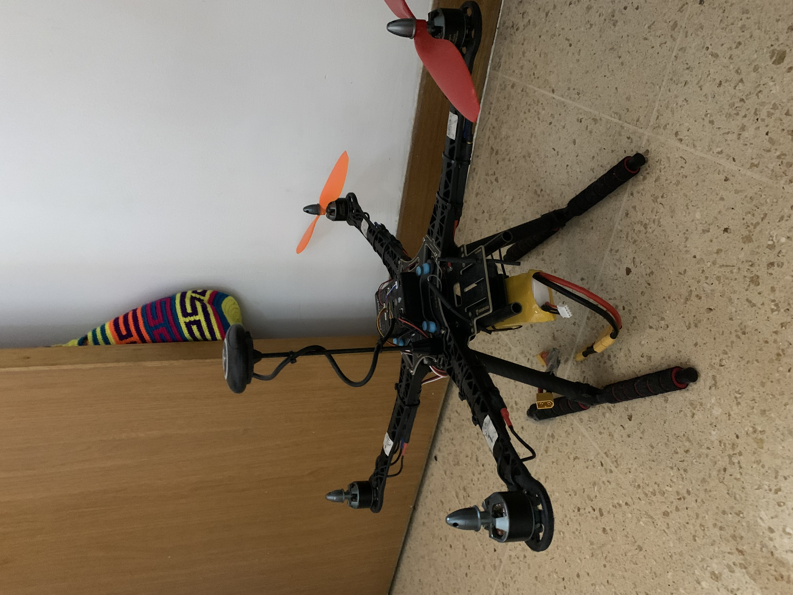
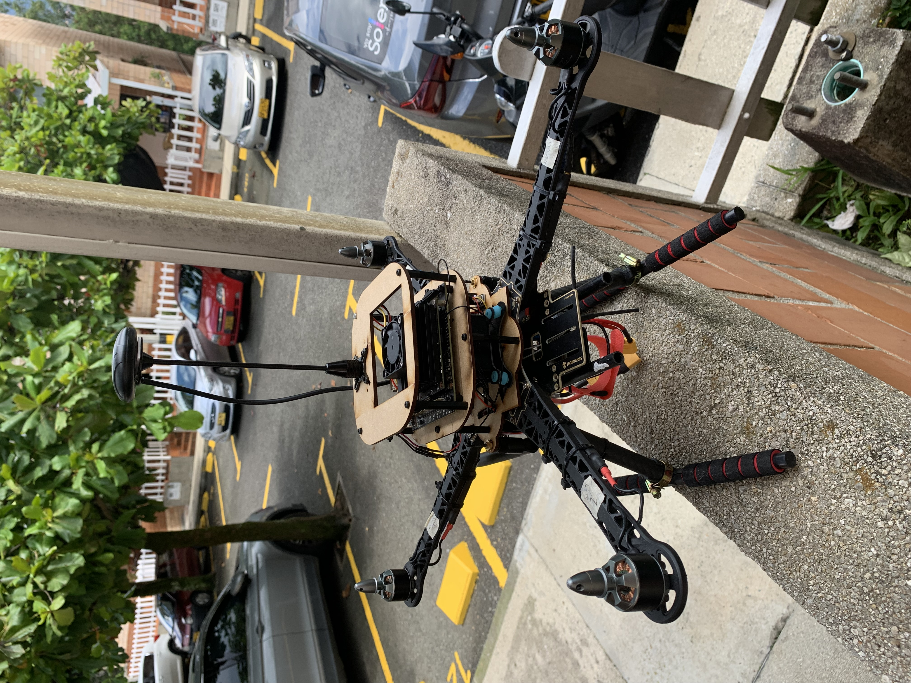
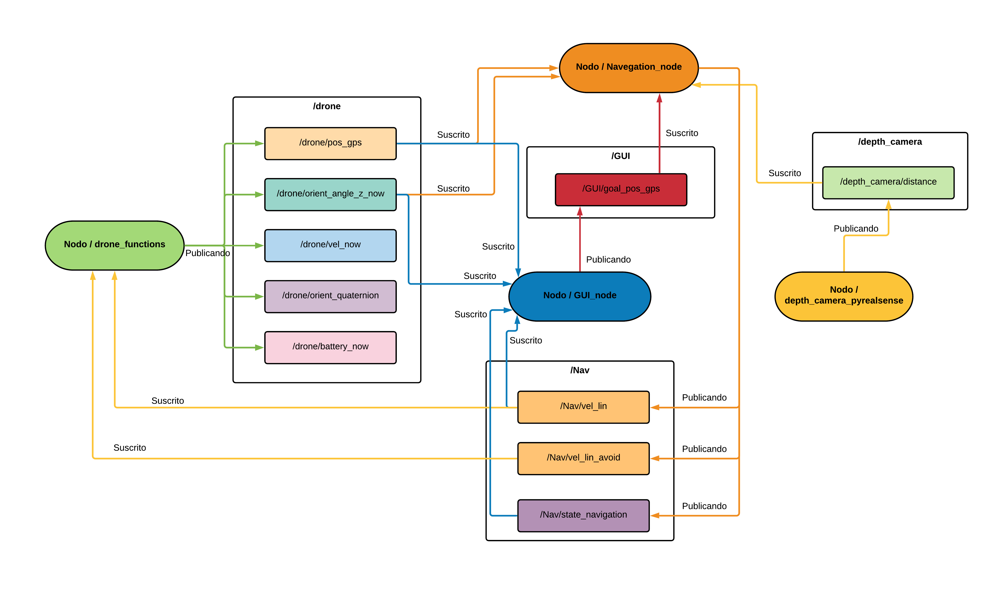
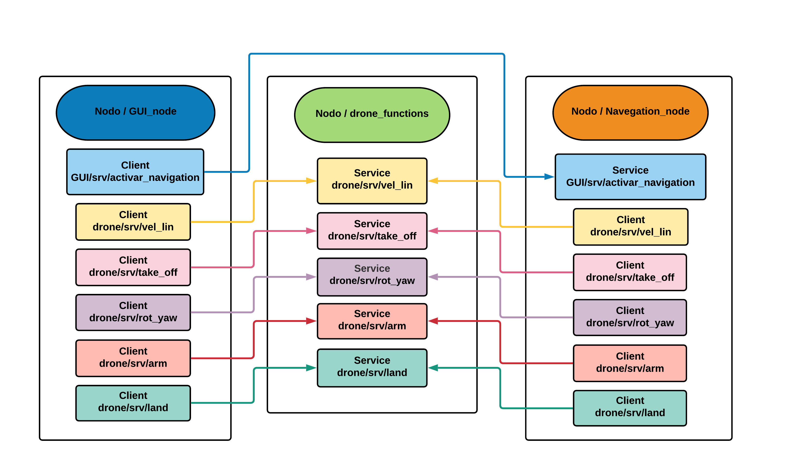
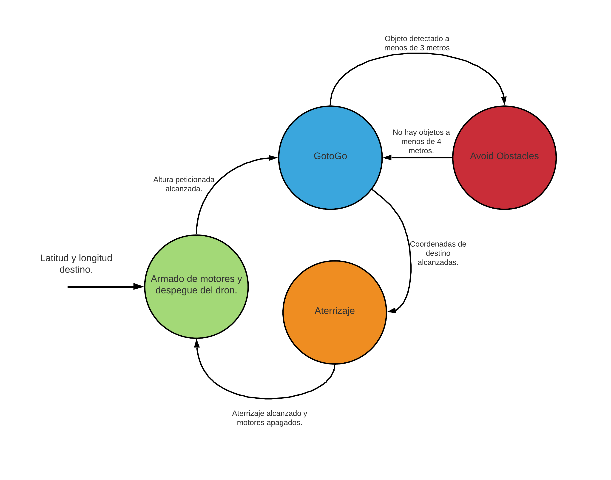

#  EXPERIMENTAL AUTONOMOUS DRONE 

### SOFTWARE DEPENDENCIES :file_cabinet:

* [ROS Melodic Morenia](http://wiki.ros.org/melodic)  

### PYTHON DEPENDENCIES

* [Python](https://www.python.org/)  
Python is a programming language that lets you work quickly and integrate systems more effectively.  

* [Dronekit](https://dronekit.io/)  
The API allows developers to create Python apps that communicate with vehicles over MAVLink. It provides programmatic access to a connected vehicle's telemetry, state and parameter information, and enables both mission management and direct control over vehicle movement and operations.

* [OpenCV](https://opencv.org/)  
OpenCV (Open Source Computer Vision Library) is a library of programming functions mainly aimed at real-time computer vision.

* [Pymavlink](https://github.com/ArduPilot/pymavlink) 
It is a Python adaptation of the MAVLink communication protocol.

* [Pyrealsense2](https://intelrealsense.github.io/librealsense/python_docs/_generated/pyrealsense2.html)  
It is a library that allows accessing and extracting information from the Intel RealSense D435I camera.

* [Tkinter](https://docs.python.org/es/3/library/tk.html) 
Package used for the creation of the graphical interface for navigation monitoring.

## EXPERIMENTAL DRON

The following elements were used to assemble the drone:

* [Readytosky® S500 Quadcopter Frame Stretch X FPV Drone Frame Kit PCB version with carbon fiber landing gear](https://www.amazon.com/gp/product/B01N0AX1MZ/ref=ppx_yo_dt_b_asin_title_o06_s00?ie=UTF8&psc=1) 

* [Readytosky Pixhawk PX4 flight controller Pix 2.4.8](https://www.amazon.com/gp/product/B07CHQ7SZ4/ref=ppx_yo_dt_b_asin_title_o05_s00?ie=UTF8&psc=1) 

* [Readytosky M8N GPS module Built-in compass with GPS antenna](https://www.amazon.com/gp/product/B01KK9A8QG/ref=ppx_yo_dt_b_asin_title_o04_s00?ie=UTF8&psc=1) 

* [GARTT 2 pairs ml2312s 960 kv 2212 Brushless Motor CW CCW](https://www.amazon.com/gp/product/B06ZZQL33X/ref=ppx_yo_dt_b_asin_title_o04_s00?ie=UTF8&psc=1)

* [Readytosky 40A ESC 2-4S brushless ESC electronic speed controller 5V/3A BEC](https://www.amazon.com/Readytosky-escobillas-controlador-electr%C3%B3nico-helic%C3%B3ptero/dp/B09G5S9YYG/ref=sr_1_1_sspa?__mk_es_US=%C3%85M%C3%85%C5%BD%C3%95%C3%91&keywords=esc+40+a&qid=1636741117&sr=8-1-spons&psc=1&spLa=ZW5jcnlwdGVkUXVhbGlmaWVyPUFQRlFTUVg2V0hSREQmZW5jcnlwdGVkSWQ9QTEwMzkwNzMzNlFaVTkyOFZFNUtMJmVuY3J5cHRlZEFkSWQ9QTAzNTcwMzQ3VUJGOEY1NEJPUlgmd2lkZ2V0TmFtZT1zcF9hdGYmYWN0aW9uPWNsaWNrUmVkaXJlY3QmZG9Ob3RMb2dDbGljaz10cnVl) 

* [Pixhawk 5.3V BEC XT60 Power Module Connectors for APM2.8 2.6 Quadcopter](https://www.amazon.com/gp/product/B07PJRXHPY/ref=ppx_yo_dt_b_asin_title_o02_s00?ie=UTF8&psc=1) 

* [Lutions Damping Plate Fiberglass Fiberglass Flight driver Anti-vibration](https://www.amazon.com/gp/product/B01KKB4SNI/ref=ppx_yo_dt_b_asin_title_o02_s00?ie=UTF8&psc=1) 

* [Readytosky 6 pairs 10x4.5 1045 propeller CW CCW 10 inches](https://www.amazon.com/gp/product/B0823NNTKD/ref=ppx_yo_dt_b_asin_title_o00_s00?ie=UTF8&psc=1) 

* [HRB 11.1V 5000mAh 3S 50C-100C LiPo battery](https://www.amazon.com/-/es/5000mAh-50C-100C-bater%C3%ADa-enchufe-escobillas/dp/B06XNTHQRZ/ref=sr_1_10?__mk_es_US=%C3%85M%C3%85%C5%BD%C3%95%C3%91&crid=AJAC7BXK0JYD&keywords=3s+5000mah+lipo+battery&qid=1636741208&sprefix=Battery+LiPo+500%2Caps%2C243&sr=8-10) 

* [Flysky FS-i6X - 6-10 Channel Remote Control Transmitter](https://www.amazon.com/gp/product/B0744DPPL8/ref=ppx_yo_dt_b_asin_title_o03_s00?ie=UTF8&psc=1) 

The following Youtube link will show a tutorial of how this drone was assemble.

Youtube

The drone assembly before being integrated with the navigation system looks as follows:

  

And in these Youtube videos you will be able to observe how it behaves while flying.

* [Stabilization tests](https://youtu.be/OdA1hklx3Kw) 
* [First flight tests](https://youtu.be/eaa0WxqBArw) 

## NAVIGATION SYSTEM :flying_saucer:

The following components were used for the navigation system:

* [NVIDIA Jetson Nano Developer Kit](https://www.amazon.com/gp/product/B084DSDDLT/ref=ppx_yo_dt_b_asin_title_o01_s00?ie=UTF8&psc=1) 
* [Wireless-AC8265 - Dual-mode wireless NIC module for Jetson Nano Developer Kit M.2 NGFF](https://www.amazon.com/gp/product/B07SM4SPLV/ref=ppx_yo_dt_b_asin_title_o00_s00?ie=UTF8&psc=1) 
* [Intel RealSense - Depth camera D435i](https://www.amazon.com/-/es/Intel-RealSense-profundidad-plateado-82635D435IDK5P/dp/B07MWR2YJB/ref=sr_1_2?__mk_es_US=%C3%85M%C3%85%C5%BD%C3%95%C3%91&keywords=D435i&qid=1636746456&sr=8-2) 

An MDF structure is built to attach these elements to the drone and thus make use of the integration of all these technologies. 

The system aspect of the experimental drone is as follows.

  

A simple navigation system is developed directing the UAV to a previously defined terrestrial coordinate. The navigation script is in charge of taking off, orienting, moving and landing the drone to the destination point.

[Navigation node](https://github.com/Yespa/Autonomous_drone_ws/blob/master/src/drone/scripts/navegation_test_node.py) 

This algorithm is the head of the drone navigation, like the previous ones is done under the structure of a ROS node in the Python 2.7 language, this will be subscribed to all the topics that are being published by other nodes as its operation depends on all the information it receives.

This program has two methods for navigation, the first method is the "GotoGo", this is responsible for orienting and directing the drone to a point on earth (latitude and longitude) previously requested by the user. This method depends on the current orientation and the current GPS position of the drone delivered by the drone function node.

And the "obstacle avoidance" method (AvoidObstacles in the script) is in charge of sending the corresponding velocities in the X-axis, Y-axis and Z-axis in order to avoid hitting any object in the visual range of the depth camera.
camera's visual range. This method uses the messages arriving from the depth camera node, which corresponds to 9 distances.

For the navigation to run it was necessary to create other scripts that run in parallel as ROS nodes in the Python framework and these are:

[Drone function node](https://github.com/Yespa/Autonomous_drone_ws/blob/master/src/drone/scripts/drone_functions_node.py) 

This program is in charge of communicating the Jetson Nano with the Pixhawk flight controller, receiving all the information from the sensors, data from the flight controller and, allowing to send navigation commands.

[Depth camera node](https://github.com/Yespa/Autonomous_drone_ws/blob/master/src/drone/scripts/depth_camera_pyrealsense_node.py) 

In this node all the information from the depth camera is obtained, the captured image is divided into 9 fragments and the average of the depths of the pixels found in each of the 9 divided squares is obtained, thus mitigating in part the noise generated by light changes. Then the 9 distances obtained are sent to the navigation node by means of a ROS topic.

[Graphical interface node](https://github.com/Yespa/Autonomous_drone_ws/blob/master/src/drone/scripts/GUI_node.py) 

The main function of the GUI is to allow the user to visualize the current position, orientation, altitude and X-axis velocity parameters, also the current navigation status can be visualized, that is, if the UAV is taking off, avoiding obstacles, landing, among others. It has a panel of 7 buttons that interact directly with the services of the drone functions node to allow the user to manage the UAV manually and especially to perform a debug of each of its functions. There is also the section where the destination coordinates and the takeoff height are typed, which will be published in the topic called "GUI/goal_pos_gps", the navigation will be executed by means of the service "GUI/srv/activate_navigation" that is activated once the start navigation button is clicked.

The interface does not run directly on the Jetson Nano as it would increase the computational consumption. would increase the computational consumption and make the processes take longer to run. processes take longer to run. To use the GUI in conjunction with the whole navigation system it is necessary to use a ROS tool called necessary to use a ROS tool called "Multiple Remote Machine", this allows to connect several machines to a Multiple machines can be connected to the same ROS Master system remotely through a SSH connection through a SSH connection where all the machines share the same public IP (Łukuzzi). public IP. In the case of this project, the node of the In the case of this project we run the GUI node on a computer that will be on the ground and the rest of the nodes on the Jetson Nano. Nano, as both computers are on the same ROS system, they will be able to share their messages without their messages without any problem between them.

Communication between these nodes is as follows.

#### Topics
  
#### Services
  

And its logic follows with respect to this finite state machine.

  

In the following videos you can see how the navigation system works in simulations and in real life.

### Videos of the simulations

* [GotoGo navigation simulation](https://youtu.be/Xa8Zr5M3L-0) 
* [Avoid Obstacles Simulation](https://youtu.be/eaa0WxqBArw) 
* [Avoid Obstacles & GotoGo Simulation](https://youtu.be/6rM8IQlQfck)) 

### Real life videos

* [Live testing of the drone's function node and the GUI manual mode](https://youtu.be/Qjc_Ib7Lg54) 
* [Coordinate 1 - GotoGo navigation test in real life](https://youtu.be/EWi795xQ4LM) 
* [Coordinate 2 - GotoGo navigation test in real life](https://youtu.be/gR4qH2ywwgE) 

## AUTHOR

#### William Yesid Palencia Arismendy
Final semester student of mechatronics engineering at EIA University.

